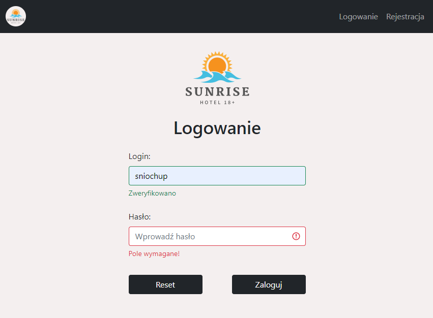

# Hotel management
Dockerized Spring MVC application for hotel management integrated with PostgreSQL database using JPA. To secure the application we used spring security and to style thymeleaf template - Bootstrap 5 and some jQuery.

The app includes three role with a different functionalities available for each of them:
- Client   - example credentials ("pawel", "pawel"), you can also register new client using registration form
- Employee - example credentials ("janek", "janek"), you can also add new employee from owner account
- Owner    - example credentials ("admin", "admin")

Program language version: Polish

## Requirements
- [Spring Framework](https://spring.io/) version 2.6.6
- Java 11 (SDK 11)
- Maven
- Docker

## Build
The server starts on the localhost default 8080 port -> http://localhost:8080/

### With docker
To run application go to the project directory and in command line type:
```
mvn clean install -DskipTests
docker compose up
```

### IntelliJ IDEA
To run only postgres database type:
```
docker run --name hotel-db -p 5432:5432 -e POSTGRES_USER=hotel -e POSTGRES_PASSWORD=a1s2d3f4 -d postgres
```
Then you can work with intelliJ environment and dockerized database.
I recommend using built-in IntelliJ professional - Database tool which you can configure following this [TUTORIAL](https://www.jetbrains.com/help/idea/postgresql.html).

## App appearance
#### Login form

#### Home Page

#### Example table


#### Example form
